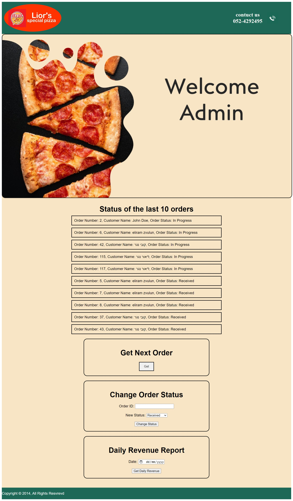
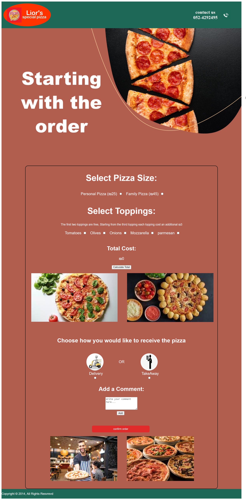
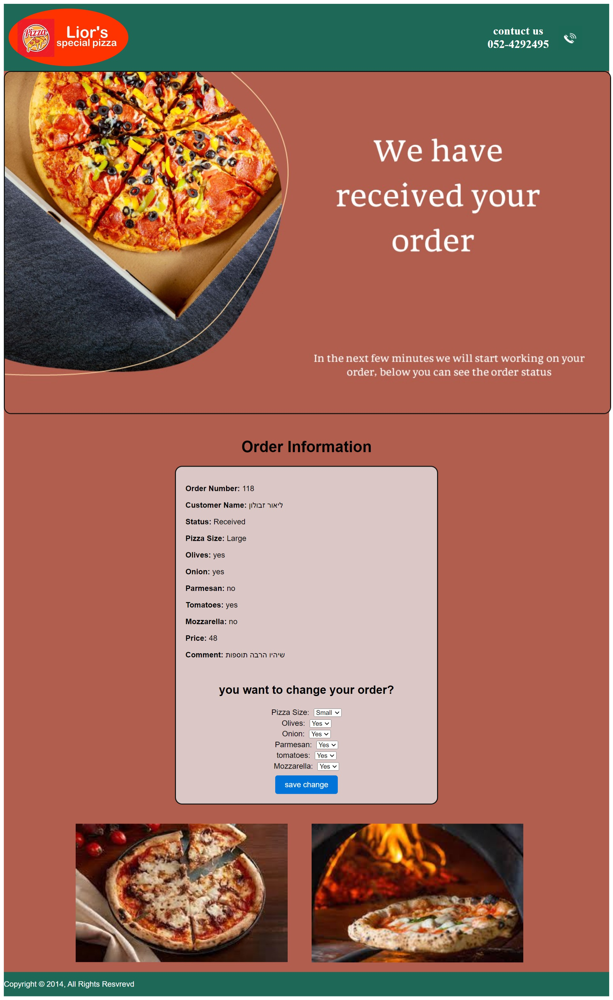

# Pizza-website

# 1. Home screen:

 

On the home screen you can see the logo, information about the pizzeria, in addition the user can enter initial details to start the order, and by pressing the button go to the order page.
Before moving, I perform the following tests:
If one of the data boxes is empty - a notification is sent to the user - please fill in all the required data. If the email entered was not entered correctly - a notification is sent to the user - please enter a valid email address.

In addition, there is the possibility of an admin login - which transfers to a management page, when the admin data is entered, a request is sent to the server which sends a query to the DB if the user really exists in the admin table and if his details are correct, only if the user exists and the password matches will the admin move to the next page.

# 2. Admin page:

 

On the page you can see:
1. The first ten orders that return from the orders_status function (limited to 10 in terms of beauty of display). Updated every 15 seconds.
2. The possibility to receive the next order that needs to be prepared (will appear when the button is pressed).
3. The possibility to change the status of an order.
4. The option to calculate daily income according to the date entered.

   
# 3. Order page:

 

We will reach this page after entering the first details on the home screen.
The customer can now start placing the order, which includes choosing a pizza size, choosing toppings and choosing a way to receive the order.
In addition, the customer can use the Calculate Total button to calculate the amount of his order according to his choices. And the customer can also add a note to the order.
At the end of selecting the order data, the customer will click on the order confirmation button and go to the page that shows the status of the order
Before moving, I perform the following tests:
If a pizza size is not selected - a notification is sent to the user - please select a pizza size. If no way to receive the order was entered - a notification is sent to the user - please choose a way to receive the order.

# 4. Order status:

 

As you can see, all the order data appears on the screen and is updated every 15 seconds, in addition the customer can update the order, change pizza size or change toppings.
When we click on the order update button we can see all the updated data on the screen, and in addition all the order update buttons disappear (thinking that the order has already been updated and it will not be necessary to use the update again).
As stated, every 15 seconds a query is sent to check if the order status has been updated, if the order status has changed to "in preparation" (and the user has not yet been updated) all the update buttons disappear (with the intention that it is impossible to update an order already in preparation) and of course the order status changes on the screen as well .
